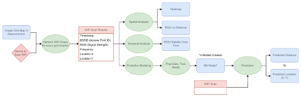

# Indoor Location Modeling Project

## Logan Gall, gal0487

This project serves as a study on using WiFi signal scans for indoor localization. This project scans WiFi signals, then performs spatiotemporal analysis on the resulting WiFi scan data. A thorough explanation of project methodology can be read in `Report.pdf`

## Files

The repository is split up into multiple files, here is the list of files with a brief description.

### `Report.pdf`

This is the report of this project, giving detailed explanation of the project goals and deliverables.

### `wifi_scanner.py`

This is a WiFi scanning Python script that takes input of the current X Y location and desired logging time, then scans WiFi for the desired amount of time, logging the data to `wifi_scan_results.csv`, appending if the csv already exists. This was originally designed to be run on a Raspberry Pi 4b device, which by default scans at about a 4 second interval.

### `wifi_scan_results.csv`

This is a results CSV file containing the raw data from the wifi scans performed above. It contains rows that are used in later data analysis:

- **Timestamp**: Timestamp of the WiFi data scan.
- **Location\_X**: The X coordinate location in the Geocommons local coordinate system.
- **Location\_Y**: The Y coordinate location in the Geocommons local coordinate system.
- **BSSID**: The unique identifier for the given WiFi network signal. Each individual access point can have multiple BSSID corresponding to a WiFi network and Frequency.
- **SSID**: The WiFi network name associated with the given BSSID; this does not uniquely identify the given WiFi signal.
- **Frequency**: The frequency at which the wireless signal is transmitted, a number near either 2.4 GHz or 5.8 GHz. The different frequencies have different physical properties, like how far the signal can travel.
- **RSSI (dBm)**: Received Signal Strength Indicator, measured in dBm. This shows how strong the quality of the WiFi signal is. This value is negative. Lower values mean weaker signal strength.

### `Data_Analysis.ipynb`

This is the primary analysis file used in the project. It contains many parts to perform analysis, create plots, and perform neural network model training:

* Display raw data
* Heatmap plot
* RSSI vs Distance plot
* 4 Neural Network Model Predictions
    * Full model to predict X and Y location
    * Partial model to predict X and Y location
    * Full model to predict distance
    * Partial model to predict distance
* Plot of neural network predictions

### `train_model.py`

This is a copy of the code to train a Full model to predict X and Y location to be able to be run independently and create a `model.h5` file which stores neural network model weights.

### `model.h5` and `scaler.joblib`

These are neural network model files which are saved when a neural network model was created. These allow a program to later access the model without having to re-train everything.

### `app.py`

This is a program that creates an interactive plot of the best neural network model and spatiotemporal analysis. It uses plotly and dash to host the interactive plot on a website that can be accessed at the port 8080, which is used by Google Cloud Run to create containerized websites.

### `dockerfile`, `cloudbuild.yaml`, `requirements.txt`

These are required files in order to host the github repository as a Google Cloud Run web application. This web application can be accessed by going to https://z.umn.edu/IndoorLocationTrackingModel or https://indoorlocationmodeling-559928205854.us-central1.run.app/ . This website may take a few minutes to load initially, as it has to read the model file and load data.

## Acknowledgements

The code for this project was created with the assistance of Generative AI (ChatGPT).